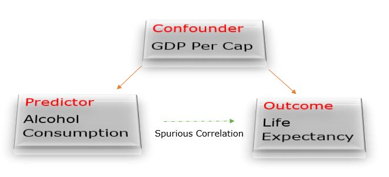

\begin{center}
$^{1}$ UW Information School, wang20@uw.edu

$^{2}$ University of Washington, drakerw@uw.edu
\end{center}


## Introduction

Researchers have extensively studied the relationship between alcohol
consumption and longevity. However, it is a common phenomenon that the
findings obtained by one author differ from the result of others on such
topics due to a difference in research methodology and data collection.
On the one hand, studies suggest "drinking about two glasses of wine or
beer a day was linked to an 18% drop in person's risk of early
death."[^1] On the other hand, some researchers challenge the findings
by stating that "the more alcohol a person drinks, the higher their risk
of early death."[^2] What, then, is the truth? Could it also be possible that there is no relationship between the two entities? 

[^1]: Jamie Ducharme, "Can Alcohol Help You Live Longer? Here's What the
    Research Really Says," Time, February 20, 2018,
    <https://time.com/5166514/moderate-drinking-live-longer-study/>.

[^2]: Angela Wood and Ellie Paige, "Drinking a Pint of Beer May Lower
    Your Life Expectancy by the Same Amount as Smoking a Cigarette --
    New Research," The Conversation, April 12, 2018,
    <https://theconversation.com/drinking-a-pint-of-beer-may-lower-your-life-expectancy-by-the-same-amount-as-smoking-a-cigarette-new-research-90346>.

This project will make use of three separate data sets from the *World
Bank* data repository in order to answer the following question: **Does
alcohol consumption lead to longer life expectancy?** In order to
address this question, we will use international country-level data that
quantifies alcohol consumption, average life expectancy, and also GDP
(to address a possible confounder). Alcohol consumption is a virtually
universal trait among cultures across the world and is an aspect of
human life that may be playing a part in determining the length of our
collective life spans. From time to time there will be popular
scientific articles detailing the health benefits of a nightly glass of
wine or another article arguing the contrary, so it would be insightful
to see if there is any support for either side of the argument provided
by demographic data on an international scale.

For this study, our null hypothesis will be that alcohol consumption has
*no relationship* with the life expectancy per capita, and the
alternative hypothesis that we are interested in exploring is that
alcohol consumption *is linked* to longevity. If there is a
relationship, we can then explore if the relationship is positive or
negative.

> $H_{o}$: alcohol consumption is not linked to life expectancy
>
> $H_{a}$: alcohol consumption is linked to life expectancy
>
> $\alpha: 0.05$

------------------------------------------------------------------------

## Data

As stated in the introduction, the source of our data will be the *World
Bank*, which is an online repository of national and international
statistics put together by the *World Bank's Development Data Group*.
The majority of these statistics are provided by the statistical systems
of the countries themselves. The *World Bank* also works to assist
underdeveloped countries with the implementation of statistical systems
and attempts to raise awareness of the importance of data driven
decision making. This report will make use of 3 specific data sets which
are detailed below: <br>

-   **GDP($):** Measured by GDP per capita by current international
    currency rates. Link:
    <https://data.worldbank.org/indicator/NY.GDP.PCAP.PP.CD>

-   **Life Expectancy(Years):** Measured by average life expectancy at birth in
    years. Link: <https://data.worldbank.org/indicator/SP.DYN.LE00.IN>

-   **Alcohol Consumption(Liters):** Measured in alcohol consumption per capita
    by liter of pure alcohol. Link:
    <https://data.worldbank.org/indicator/SH.ALC.PCAP.LI>

```{r include=FALSE}
library(tidyverse) 
library(maps) #geographic data
library(scales) #format plot x scales and labels
library(stargazer) 
library(broom) 
library(knitr) 
library(tibble) 
library(ggthemes) 
library(wbstats) #access world bank database
library(stringr) 
```

```{r message=FALSE, warning=FALSE}

gdp_df <- read.csv("data/gdp.csv", 
                   fileEncoding="UTF-8-BOM",
                   stringsAsFactors = FALSE) %>% 
          select(name, Country.Code, X2018) %>% 
          rename(GDP = X2018)

life_exp_df <- read.csv("data/life_exp.csv",
                        fileEncoding="UTF-8-BOM",
                        stringsAsFactors = FALSE) %>% 
                select(name, Country.Code, X2018) %>% 
                rename(life_exp = X2018)

alcohol_df <- read.csv("data/alcohol.csv", 
                       fileEncoding="UTF-8-BOM",
                       stringsAsFactors = FALSE) %>% 
              select(name, Country.Code, X2018) %>% 
              rename(alcohol_consum = X2018)

```

## Limitations of the Dataset/Study

The World Bank Open Data is recognized as a valid data source globally. However, there is no such thing as a perfect data set. The way that the data is collected and the quality of the information is crucial to yield the most accurate results possible that resemble reality. 

### Null Values
The section aims to scrutinize the null/missing values in the data set
```{r message=FALSE, warning=FALSE}
#merge all three datasets 
temp_merge <- gdp_df %>% inner_join(alcohol_df) %>% inner_join(life_exp_df)

colSums(is.na(temp_merge)) %>% 
  as.data.frame() %>% 
  mutate(prop = paste0(round(. * 100 / nrow(temp_merge), 2), "%")) %>% 
           kable(caption = "Null Count & Null Proportion in World Bank Data",
                 col.names = c("count", "proportion"), alight = "r")
```
The analysis suggests we have roughly 10% missing data. Missing data has a significant impact when calculating the outcome variable based on inferential statistics. 

### Time Matters
We used the data collected from 2018. The intuition is that 2018 is the most recent year in the World Bank data set with the most comprehensive information on all three entities of interest. It is unclear if the findings reflect the current situation. 

### Alcohol Consumption Per Capita
The variable contributes the most bias in our study. Based on the World Bank data set, the measurement regards the liters of pure alcohol people(15+ years of age) intake, and this is a projected estimate. It's unclear if the alcohol in question is wine, beer, or other types of alcoholic drinks. We have to admit the fact that different types of alcohol affect people differently.

### Validity
The relationship between alcohol consumption and health is often conducted on an individual level. However, in our study, we are looking at the relationship on a broader scope. We purposely choose alcohol consumption per capita, life expectancy per capita, and gdp per capita to minimize the gap between our analysis and the medical research that's been conducted on a much smaller scale. 

Further, there is a difference between drinking moderately and alcoholism. It is possible that drinking moderately would have a positive effect on life expectancy.  However, alcoholism would significantly reduce a person's lifespan, as it is reasonable to argue that too much of a good thing is counterproductive, even water.

## Data Analysis

### Life Expectancy Data

```{r, fig.height=2, fig.align='center'}

# List of latitude and longitude for different countries used for plotting 
world_map_df <- map_data("world") %>%
  mutate(Country.Code = iso.alpha(region, n = 3)) #add column Country.Code 

# Join based on Country.Code
join_life_map <- inner_join(world_map_df, life_exp_df, by = "Country.Code")

#plot map based on GDP per cap
join_life_map %>%
  ggplot() + 
  geom_polygon(aes(x = long, y = lat, group = group, fill = life_exp), color = "black") +
  coord_quickmap(expand = TRUE, clip = "on") + 
  theme_minimal() +
  scale_fill_gradient2(low = "#d73027", mid = "#ffffbf", high = "#1a9850", midpoint = 70) + 
  theme(
    plot.title = element_text(hjust = 0.5, size = 12),
    axis.text = element_blank(),
    axis.title = element_blank()) +
  labs(
    title = "Life Expectancy At Birth",
    fill = "Years"
    )

```
As we can observe from the plot, African countries tend to have a lower life expectancy.

### Alcohol Consumption Data

```{r, fig.height=2, fig.align='center'}

inner_join(world_map_df, alcohol_df, by = "Country.Code") %>%
  ggplot() + 
  geom_polygon(aes(x = long, y = lat, group = group, fill = alcohol_consum), color = "black") +
  coord_quickmap(expand = TRUE, clip = "on") + 
  theme_minimal() +
  scale_fill_gradient2(low = "#d73027", mid = "#ffffbf", high = "#1a9850", midpoint = 7) + 
  theme(
    plot.title = element_text(hjust = 0.5, size = 12),
    axis.text = element_blank(),
    axis.title = element_blank()) +
  labs(
    title = "Alcohol Consumption Per Capita",
    fill = "Liters"
    )

```
From the plot, we can observe that African countries tend to consume less alcohol.

The two above visualizations would lead us to believe that there *is* a
correlation between drinking more and living longer. Formally, the
independent variable in this study would be alcohol consumption, and the
dependent variable would be life expectancy.

Next, we would like to analyze GDP since we believe that to be the most likely source of
confounding bias in this relationship.

### GDP Data

```{r fig.height=2}

inner_join(world_map_df, gdp_df, by = "Country.Code") %>%
  ggplot() + 
  geom_polygon(aes(x = long, y = lat, group = group, fill = GDP), color = "black") +
  coord_quickmap(expand = TRUE, clip = "on") + 
  theme_minimal() +
  scale_fill_gradient2(low = "white", mid = "white", high = "#1a9850", midpoint = 5000) + 
  theme(
    plot.title = element_text(hjust = 0.5, size = 12),
    axis.text = element_blank(),
    axis.title = element_blank()) +
  labs(
    title = "GDP Per Capita",
    fill = "Dollars"
    )

```

Noticeably, the color of Africa is quite different from the rest of the
continents in all 3 maps shown. It is logical to assume that GDP might
be a confounding bias that the previous 2 maps fail to illustrate due to
its relationship with both of the independent (alcohol consumption) and
dependent (life expectancy) variables.

```{r, echo=FALSE, fig.align='center'}

```

Now we will seek to illustrate that GDP has an impact on life expectancy
and alcohol consumption level.

### GDP vs. Life Expectancy

```{r message=FALSE, warning=FALSE, fig.height=3}

gdp_life_join <- inner_join(gdp_df, life_exp_df, by = "Country.Code")

gdp_life_join %>% 
  ggplot(aes(GDP, life_exp)) + 
  geom_point() + 
  theme_classic() +
  theme(plot.title = element_text(hjust = 0.5)) +
  labs(x = "GDP Per Capita in Log Scale (Dollars)",
       y = "Life Expectancy Per Capita (Years)", 
       title = "GDP & Life Expectancy") + 
  scale_x_continuous(trans = log_trans(), 
                      breaks = trans_breaks("log", function(x) exp(x)),
                      labels = trans_format("log", math_format(e^.x))) +
  geom_smooth(se=F)

```

To illustrate the model, let
$$life.exp = \beta_{0}+\beta_{1} * ln(gdp)$$ When we increase GDP per
cap by 1%, the new GDP, $gdp_*$, becomes (1.01 \* gdp).
$$life.exp_* = \beta_{0}+\beta_{1}  ln(gdp_*) = \beta_{0}+\beta_{1}  ln(1.01gdp)$$
$$= \beta_{0} +  \beta_{1}ln(gdp) + \beta_{1}ln(1.01)$$
$$= gdp + \beta_{1}  ln(1.01)$$ $\therefore$ one percent increase in GDP
is associated with a life expectancy increase of $\beta_{1} * ln(1.01)$
years.

```{r}
mod1 <- lm(life_exp ~ log(GDP), gdp_life_join)
kable(tidy(mod1), caption = "Life Expectancy ~ ln(GDP)")
```

We have obtained a P-value of less than 0.05 and a t-statistics of 24.4. The result suggests that GDP has a statistically significant positive relationship with life expectancy. That is, for one percent increase in GDP is associated with a life expectancy increase of 
$$5.5 * ln(1.1) \approx 0.5 \space years$$ 

### Alcohol Consumption vs. GDP

```{r, warning=FALSE}

read.csv("data/geo_world.csv") %>% 
  select(Continent_Name, Three_Letter_Country_Code, Country_Name) %>% 
  rename(Country.Code = Three_Letter_Country_Code) %>% 
  inner_join(alcohol_df, by = "Country.Code") %>% 
  inner_join(gdp_df, by = "Country.Code") %>% 
  ggplot(aes(x = alcohol_consum, y = GDP, color = Continent_Name)) + 
  geom_point() +
  theme_minimal() +
  theme(plot.title = element_text(hjust = 0.5)) +
  labs(x = "Alcohol Consumption Per Capita (Liters)",
       y = "GDP Per Capita (Dollars)", 
       title = "Alcohol Consumption vs. GDP",
       color = "Continent")
  
  
```

Notice that European countries tend to have a higher GDP, and the
alcohol consumption level is also higher on average for European
countries. To further illustrate the point, we can plot alcohol
consumption vs life expectancy by continents.

```{r, warning=FALSE, message=FALSE}

read.csv("data/geo_world.csv") %>% 
  select(Continent_Name, Three_Letter_Country_Code, Country_Name) %>% 
  rename(Country.Code = Three_Letter_Country_Code) %>% 
  inner_join(alcohol_df, by = "Country.Code") %>% 
  inner_join(life_exp_df, by = "Country.Code") %>% 
  ggplot(aes(alcohol_consum, life_exp, color = Continent_Name)) + 
  geom_point() + 
  theme_minimal() +
  theme(plot.title = element_text(hjust = 0.5)) +
  facet_wrap(~Continent_Name) + 
  stat_smooth(method = "lm") +
  labs(
    x = "Alcohol Consumption Per Capita (Liters)",
    y = "Life Expectancy Per Capita (Years)",
    title = "Alcohol Consumption vs. Life Expectancy by Continent"
  )

```

Notice that there is not a strong positive correlation between alcohol
consumption and life expectancy for African countries. That is to say,
the life expectancy of African people would not get higher by drinking
more alcohol.

To directly evaluate the relationship between alcohol consumption and
life expectancy, we will take all countries into consideration and
cluster the data with a k-means method.

### K-Means (Training Data)

```{r, message=FALSE, warning=FALSE}

alcohol_life_df <- inner_join(alcohol_df, life_exp_df) 
filter_alcohol_life_df <- alcohol_life_df %>% 
  select(alcohol_consum, life_exp) %>% 
  filter(!is.na(alcohol_consum), !is.na(life_exp))

k_2means <- kmeans(filter_alcohol_life_df, centers = 3)

plot(filter_alcohol_life_df[k_2means$cluster == 1, ], col = "blue", ylim=c(50,90), 
     main = "Training Dataset with K = 3", xlab = "Alcohol Consumption Per Capita (Liters)",
     ylab = "Life Expectancy Per Capita (Years)")
points(filter_alcohol_life_df[k_2means$cluster == 2, ], col = "red")
points(filter_alcohol_life_df[k_2means$cluster == 3, ], col = "green")

```
The findings from K-means clustering are not particularly useful in this case because we know the labels of the data. We can infer that the top right region corresponds to European countries, while the bottom region correspond to African countries.

### Labeled data

```{r, message=FALSE, warning=FALSE}

read.csv("data/geo_world.csv") %>% 
  select(Continent_Name, Three_Letter_Country_Code, Country_Name) %>% 
  rename(Country.Code = Three_Letter_Country_Code) %>% 
  inner_join(alcohol_df, by = "Country.Code") %>% 
  inner_join(life_exp_df, by = "Country.Code") %>% 
  ggplot(aes(x = alcohol_consum, y = life_exp,
             color = Continent_Name)) + 
  geom_point() +
  xlim(c(0,17)) + 
  theme_minimal() +
  theme(plot.title = element_text(hjust = 0.5)) +
  labs(
    x = "Alcohol Consumption Per Capita (Liters)",
    y = "Life Expectancy Per Capita (Years)",
    title = "Alcohol Consumption vs. Life Expectancy by Continent",
    color = "Continent"
  )

```

Again, we can clearly see that European countries tend to cluster around
the top right corner, meaning that European countries have a higher life
expectancy, and they tend to consume more alcohol as well. However,
there is no evidence indicating that there is a causal relationship
between alcohol consumption and life expectancy based on plotting the
two variables directly as shown below.

------------------------------------------------------------------------

## Results

```{r, message=FALSE, warning=FALSE}

alcohol_life_df %>% 
  ggplot(aes(x = alcohol_consum, y = life_exp)) + 
  geom_point() + 
  theme_minimal() +
  theme(plot.title = element_text(hjust = 0.5)) +
  labs(
    title = "Alcohol Consumption vs. Life Expectancy",
    x = "Alcohol Consumption Per Capita (Liters)",
    y = "Life Expectancy Per Capita (Years)")

```

The above scatterplot shows no obvious correlation or pattern in the
data, and we will explore that relationship mathematically with a linear
regression model below:

```{r, results='asis'}

merge_al_life_gdp <- alcohol_life_df %>% 
  inner_join(gdp_df, by = "Country.Code") %>% 
  select(alcohol_consum, life_exp, GDP) %>% 
  filter(!is.na(alcohol_consum), !is.na(life_exp), !is.na(GDP))


model <- lm(merge_al_life_gdp, formula = life_exp ~ alcohol_consum + 
              GDP + alcohol_consum:GDP)

kable(tidy(model), caption = "Life Expectancy ~ Alcohol Consumption + GDP")

```

Interpretation regarding predictor `alcohol_consum`: 

**estimate**: This column is used to predict the value of the response variable. In this case, we can conclude that, while holding all other predictor variables constant, the change in life expectancy associated with a Liter increase of alcohol consumption is 0.18 years. (However, this number alone is meaningless if we don't take confidence interval and p value into consideration)

**std.error**: The average amount that the estimate deviates from the actual value. This number is often used to calculate the confidence interval. We see that a std.error is 0.14 which is relative large to the coefficient estimate obtained.

**statistics**: This is the equivalent of the t-value, which is calculated using estimate / std.error. If the t-value is relatively high, the coefficient is statistically significant. As we can see here, the t-value for `alcohol consumption` is a lot lower than the t-value for `GDP`. 

**p.value**: This is the p-value for the t test. The smaller the P-value, the stronger the statistical significance. In other words, it is very likely that the relationship between the dependent variable and independent variable is due to random chance. Due to the large P-value (>0.05), we can't reject the null hypothesis that there is no relationship between alcohol consumption and life expectancy. In other words, "there is no relationship between alcohol consumption and life expectancy" still holds true. 

## Confounding Bias and Conclusion

As can be seen in the above linear model results, our p-value result for
alcohol consumption's correlation with life expectancy is greater than
0.05, leading us to fail to reject the null hypothesis and conclude that
there is no relationship based upon the data within this report. We
included GDP in the linear model due to the clear relationship and
possible confounding that we had uncovered throughout the report. There
very well may be other confounding factors that are not present in our
data set such as cultural norms (smoking and drinking together,
early-age drinking laws, etc.), types of alcoholic beverages that are
being consumed (do wine, beer, or hard alcohol drinks change the
relationship?), domestic instability (do war-torn countries drink
more/less and have lower life-expectancy? do peaceful countries drink
more/less and live longer?), and other factors that may be harder to
quantify. We again have to acknowledge the limitations of the data set itself and the simple regression model that's been leveraged. The data sets are limited by the accuracy of the data
collection techniques of the countries themselves and since the
estimations are on such a large scale the errors could have massive
implications on our regression models and data analysis. These
statistics could be used to forge new policies and write new laws so
there could also be some reason for countries to misreport or
inaccurately record numbers such as these. 

Even with all of these limitations and possible confounders in play, the relationship was clearly far from a strong correlation (as seen in the many plots) so we
are quite confident in our conclusion that there is no direct
relationship between alcohol consumption and life expectancy based on the World Bank data alone. 

------------------------------------------------------------------------

Future Research: It seems like there is a strong correlation between GDP
per cap and life expectancy. Can we say that the higher the GDP, the
higher the life expectancy? Or does the pattern only exist to a certain
degree? Based on the GDP vs. life expectancy plot, it makes sense that
the slope decreases gradually as GDP approaches a certain number due to
the fact that humans can't live forever. However, could it be that rich
countries tend to exhibit unhealthy habits such as smoking and fast
food, such that it lowers their life expectancy?
\newpage

An excellent way to visualize the three entities is to use a 3D plot. I tried to visualize the regression line in 3D (the 2D regression becomes a plane). Based on the live 3D plot, we can clearly see that there is a strong correlation between GDP and life expectancy. We don't observe a strong positive or negative relationship between alcohol consumption and life expectancy. 
That being said, we can't see the benefits of the 3D plot because R Markdown doesn't render live plots that we can drag around.  

```{r setup, include=FALSE}
library(reticulate) #py
```

```{python, echo=FALSE, message=FALSE, warning=FALSE, eval=FALSE}
# a 3d plot contains alcohol, life expectancy and GDP
#@ visualize the 3d regression surface
import pandas as pd
import matplotlib.pyplot as plt
import matplotlib.pylab as pylab
import statsmodels.formula.api as smf
import numpy as np
import warnings

warnings.filterwarnings("ignore")
font_size = 10
df = pd.merge((pd.read_csv("./data/alcohol.csv")
        .loc[:, ["name", "Country Code", "2018"]]
        .rename(columns={"2018": "alcohol"})),
    (pd.read_csv("./data/gdp.csv")
    .loc[:, ["name", "Country Code", "2018"]]
    .rename(columns={"2018": "gdp"})),
).merge((pd.read_csv("./data/life_exp.csv")
        .loc[:, ["name", "Country Code", "2018"]]
        .rename(columns={"2018": "life"}))
)
x_surf, y_surf = np.meshgrid(
    np.linspace(df.alcohol.min(), df.alcohol.max()),
    np.linspace(df.gdp.min(), df.gdp.max()),
)
fig = plt.figure()
ax = plt.figure().add_subplot(111, projection="3d")
ax.set_xlabel("alcohol(L)", fontsize=font_size);
ax.set_ylabel("GDP($)", fontsize=font_size);
ax.set_zlabel("life expectancy(yrs)", fontsize=font_size);
ax.scatter(df.alcohol, df.gdp, df.life, c="purple", marker="+");
ax.plot_surface(x_surf, y_surf, 
                np.array(smf.ols(formula="life ~ alcohol + gdp", data=df)
             .fit().predict(
                 exog=pd.DataFrame({"alcohol": x_surf.ravel(), 
                                    "gdp": y_surf.ravel()}))).
                reshape(x_surf.shape), alpha=0.1);
plt.show();
```

